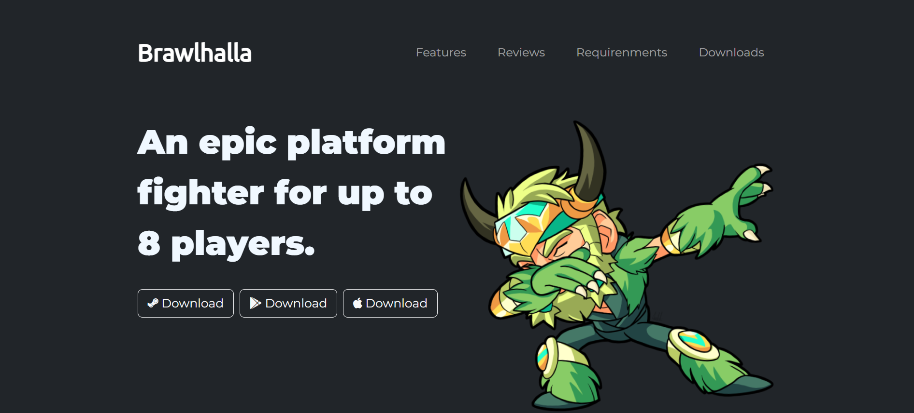

# Brawlhalla-Website



This is a front-end development project for a fictional Brawlhalla website. It showcases the game's features, reviews, system requirements, and download links.

## Description
This website is designed to promote Brawlhalla, an epic platform fighter for up to 8 players. It features a responsive design, engaging content, and interactive elements to attract visitors and encourage them to download the game.

## Technologies Used
- HTML5
- CSS3
- Bootstrap 5
- Font Awesome
- Google Fonts

## Features
- Responsive design
- Navigation bar with smooth scrolling
- Download buttons for different platforms
- Feature section highlighting game aspects
- Reviews carousel with user testimonials
- System requirements carousel for Windows and macOS
- Call to action section for downloading the game
- Social media links in the footer

## Demo
  You can view a live demo of the website <a href = "https://sahiltyagii.github.io/Brawlhalla-Clone/">here</a>.

## Installation
To run this project locally, follow these steps:
1. Clone the repository:
```
git clone https://github.com/SahilTyagii/Brawlhalla-Clone.git
```
2. Navigate to the project directory:
```
cd Brawlhalla-Clone
```
3. Open `index.html` in your browser.

## Usage
Feel free to use this project as a template for creating your own website or as a learning resource to understand front-end development techniques.

## Contributing
Contributions are welcome! If you'd like to contribute to this project, please fork the repository and submit a pull request.
